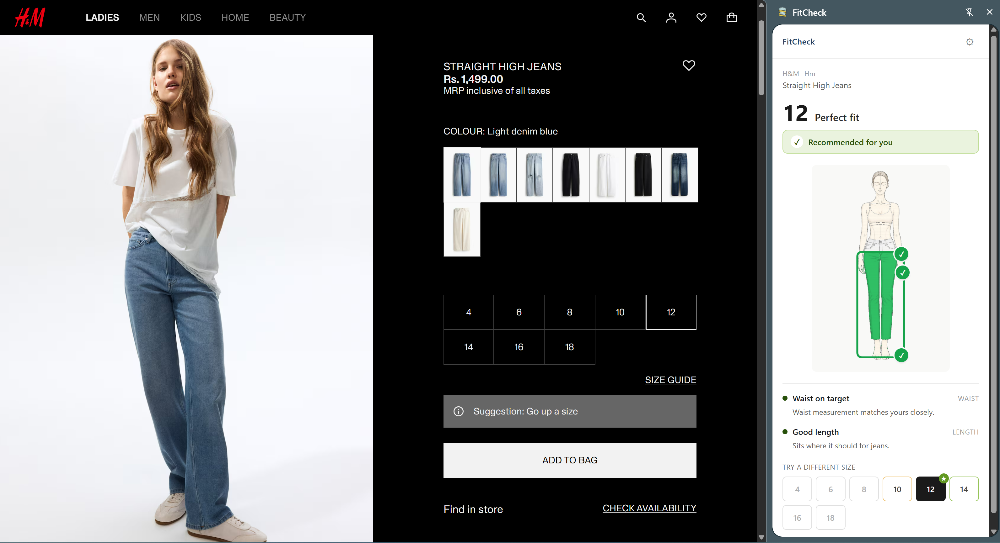
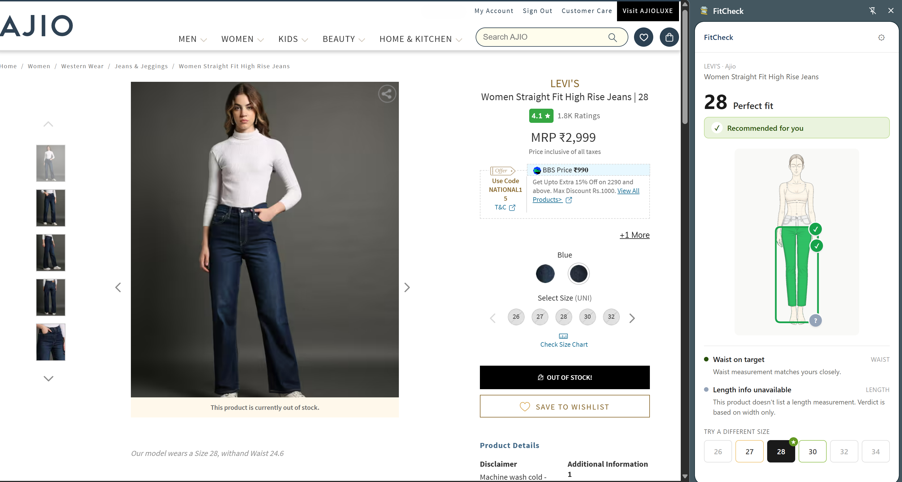
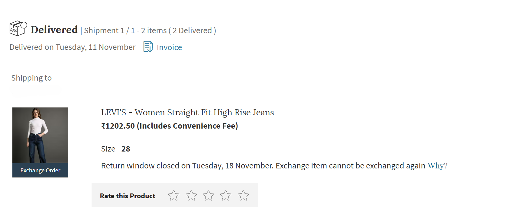
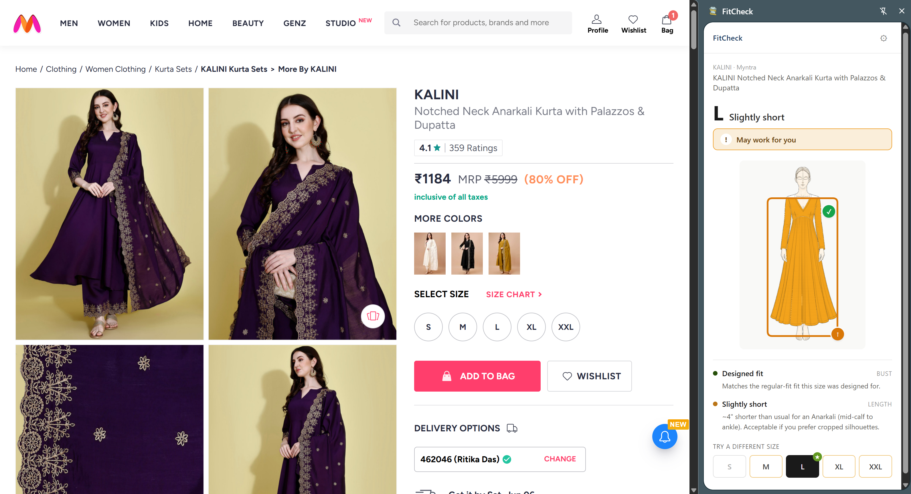
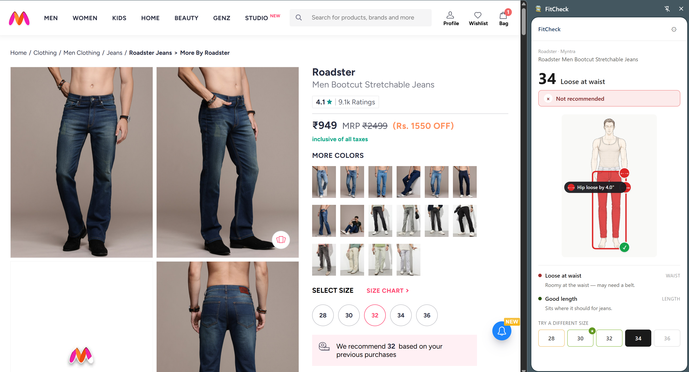
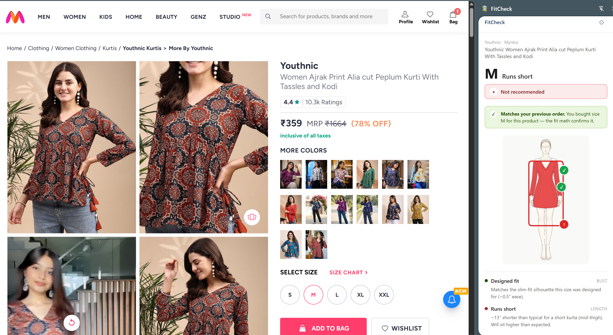
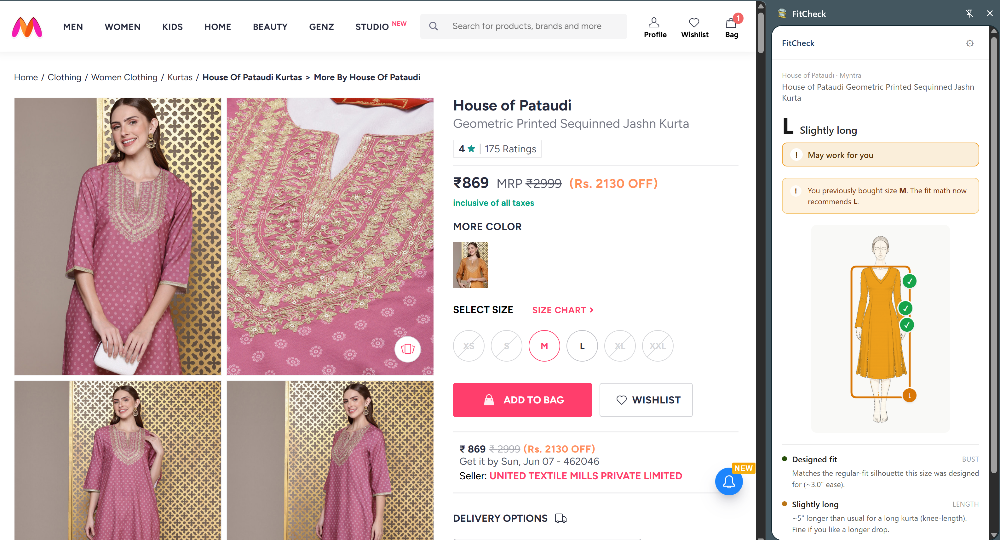

# FitCheck

> Personalized clothing fit verdicts at the point of purchase, for Indian fashion shoppers on Myntra, AJIO, and H&M India.

**[Live demo](https://fitcheck-demo.netlify.app)** · **[Install v0.6.0](https://github.com/ritikadas98/fitchecker/releases/latest)** · **[About this project](#about-this-project)**



## Why this exists

Apparel return rates in India sit at roughly 25-30%, and sizing is the leading driver. Every product page already shows a size chart, so the chart itself isn't the problem; trusting it is. A "36 inch bust" entry on the chart doesn't tell you whether *your* 34 inch bust will look snug, perfect, or roomy on *this particular cut*.

FitCheck doesn't replace the chart. It translates it into a verdict the shopper can act on, with a per-axis breakdown of *why*. The user enters their measurements once. On any supported product page, the side panel renders a recommended size with a tinted silhouette showing which axes (bust, waist, hip, length) will be snug, perfect, or loose.

## Real-world validation

The fit math has been tested against my own purchase history. A representative case from AJIO:

> I ordered size 30 jeans. They arrived too loose. I shipped them back and exchanged for size 28, which fit. The chart label and my waist measurement (both "30") seemed to agree, but the *actual* body-chart waist value for "size 28" on that Levi's cut is 30 inches — the size labels were misleading. With FitCheck running on the same product page, the extension recommends **size 28** directly. Same product, same body, would have skipped the exchange shipment.

| FitCheck recommendation on the live PDP | My actual order — exchanged 30 → 28 |
|---|---|
|  |  |

On **Myntra** order-history URLs (which surface a `size=` query param from past purchases), the side panel goes one step further and compares the recommendation against your past purchase explicitly: a green "Matches your previous order" callout when the math picks the size you actually wore, or an amber "You bought X · Math now recommends Y" when your body has shifted since. See the "Validated against past purchase" row below for examples.

## Try it

Two paths to evaluate the product, depending on how much friction you're willing to accept.

### 1. Interactive demo (no install, ~30 seconds)

Open the [live demo](https://fitcheck-demo.netlify.app) and click through ten real product fixtures across the three retailers. Enter your measurements once; the side panel runs the real fit math against each product's actual size chart. Pure browser, nothing to install.

### 2. Chrome extension on real product pages (~2 minutes)

Use the real extension on actual Myntra / AJIO / H&M India product pages:

1. Download `fitcheck-0.6.0.zip` from the [latest release](https://github.com/ritikadas98/fitchecker/releases/latest).
2. Unzip the archive anywhere on your machine.
3. Open `chrome://extensions` in Chrome.
4. Toggle **Developer mode** ON (top right).
5. Click **Load unpacked** and select the unzipped folder.
6. Pin FitCheck to your toolbar via the puzzle-piece menu.
7. Open any product on [Myntra](https://www.myntra.com), [AJIO](https://www.ajio.com), or [H&M India](https://www2.hm.com/en_in) and click the FitCheck icon.

## How it works

Three components, each scoped to one job:

- **Content script + per-retailer adapters** (`src/content/`) read the size chart and product info from the rendered DOM. Each retailer ships data differently — Myntra exposes a hydration store, AJIO uses a Redux preload, H&M India relies on a static chart that ships as Next.js hydration metadata. The adapters normalize all of that into one `ParsedProduct` shape.
- **Background service worker** (`src/background/`) receives the parsed product, computes the verdict against the stored user profile, caches state per tab.
- **Side panel React app** (`src/sidepanel/`) renders the verdict: recommended size, tinted silhouette, per-axis pins (bust/waist/hip/length where applicable), and a size-comparison row.

The fit math (`src/lib/fit-math.ts`) is the most non-obvious layer. Two paths:
- **Tops & bottoms**: two-axis (width + length).
- **Dresses**: four-axis (bust + waist + hip + length).

For tops and dresses the math is *ease-aware* — it knows the difference between body chart numbers ("this size fits a 34 inch bust") and garment-flat numbers ("the garment itself is 38 inches around"). The gap between the two encodes designer intent: 2 inches of ease is slim-fit, 8 inches is oversized. The verdict respects that. An oversized t-shirt on a 36 inch bust isn't "too tight" just because the chart targets a 32 inch body — it's actually loose because the garment itself is 40 inches.

For bottoms the math is body-chart-only since there's typically no ease at the waist (or even negative ease for stretch denim).

## What it looks like

The verdict has three tiers that the silhouette tints accordingly:

| Recommended for you | May work for you | Not recommended |
|---|---|---|
|  |  |  |
| All axes "perfect" or "good" — every dimension lands on target. | At least one axis flagged "okay" — wearable but not the designed cut. | At least one axis "poor" — physical squeeze, hem misalignment, or a cut that fights the body. |

### Validated against past purchase

On Myntra order-history URLs the side panel compares the math against the size you actually bought, in two states:

| Math matches your past purchase | Body changed since the past purchase |
|---|---|
|  |  |
| Green callout: you bought size M, the math now picks M too. Direct ground-truth confirmation that the recommendation matches a size you've actually worn. | Amber callout: you bought M previously, the math now recommends L — your body has shifted, and the math reflects it honestly rather than rubber-stamping the past purchase. |

## Project structure

```
src/
├── background/
│   └── index.ts          # Service worker — owns profile, runs fit math, caches per-tab state
├── content/
│   ├── index.ts          # Content script entry — watches for SPA navigation
│   ├── adapters/
│   │   ├── types.ts      # SiteAdapter interface
│   │   ├── index.ts      # Adapter registry
│   │   ├── myntra.ts     # Hydration-store extraction
│   │   ├── ajio.ts       # __PRELOADED_STATE__ extraction
│   │   └── hm.ts         # __NEXT_DATA__ + static size chart
│   └── utils/
│       ├── observer.ts   # URL change observer for SPAs
│       └── extractJson.ts # Brace-counting JSON extractor (Myntra + AJIO)
├── lib/
│   ├── types.ts          # Shared types across processes
│   ├── storage.ts        # chrome.storage.local wrapper
│   ├── messages.ts       # Typed message passing
│   ├── fit-math.ts       # Per-axis verdict math
│   ├── silhouette.ts     # Per-style pin layout config
│   ├── style.ts          # Garment style classifier
│   ├── tint.ts           # Canvas-based silhouette tinting
│   ├── hm-size-chart.ts  # H&M's published size chart (static)
│   └── analytics.ts      # Local event log
└── sidepanel/
    ├── index.html
    ├── main.tsx
    ├── App.tsx           # Three-state router
    ├── components/
    │   ├── ProfileSetup.tsx
    │   ├── FitVerdict.tsx
    │   ├── FitIndicators.tsx     # Pins + tags overlaid on silhouette
    │   ├── TintedComposite.tsx   # Runtime garment tinting
    │   └── Fallback.tsx
    └── styles.css

demo/                     # Interactive standalone demo (Netlify-deployed)
├── index.html
├── main.tsx
└── src/
    ├── DemoApp.tsx       # Chrome window mock + tab switcher
    ├── ChromeWindow.tsx
    ├── PdpMock.tsx       # Per-retailer PDP near-clones
    ├── shims/chrome.ts   # Shims chrome.* APIs onto globalThis
    ├── fixtures/         # 10 real product fixtures
    └── styles.css
```

## Build from source

```bash
npm install
npm run build              # extension build → dist/
npm run build:demo         # standalone demo build → demo-dist/
npm run dev:demo           # local dev server for the demo on port 5174
```

After `npm run build`, follow steps 3–7 of the **install** section above, pointing **Load unpacked** at the `dist/` folder.

## Adding a new retailer

Three steps, in order:

1. Create `src/content/adapters/<retailer>.ts` implementing the `SiteAdapter` interface. See `ajio.ts` for the cleanest example.
2. Register it in `src/content/adapters/index.ts`.
3. Add the host to `manifest.json` under both `host_permissions` and `content_scripts.matches`.

No other files need to change. The fit math, silhouettes, tinting, and side panel all consume the `ParsedProduct` shape — once your adapter emits a valid one, every downstream piece works automatically.

## How each adapter extracts data

The three adapters illustrate three different data architectures, and that variety is part of the v1 narrative:

- **Myntra** — global hydration via `window.__myx = {...}` script tag. Brace-counted JSON extraction. Has its own per-product size chart with measurements in inches. Cleanest data of the three.
- **AJIO** — Redux preload via `window.__PRELOADED_STATE__ = {...}`. Same brace-counting technique (shared util). Per-product size chart at `state.product.sizeData.sizechart[0].brickBrandSizes[]`, measurements in inches as strings (often with empty values for dims a brick category doesn't carry).
- **H&M India** — Next.js hydration via `<script id="__NEXT_DATA__" type="application/json">{...}</script>`. Identity and size labels come from the page; per-size body measurements do NOT — the size guide modal lazy-loads from `api.hm.com` after render, which a content-script-only architecture cannot fetch. The adapter falls back to H&M's standardized published size chart (shipped as static data in `lib/hm-size-chart.ts`) for bust/waist/hip, and pulls per-product garment length from `productAttributes.measurement` when available.

## Why Westside isn't in v1

Investigated and intentionally scoped out. Westside (Shopify-based) exposes its size chart **only as a PNG image** in the size-guide drawer:

```html

```

There are zero `<table>` tags in a Westside PDP and zero machine-readable bust/waist/hip values anywhere in the rendered HTML. A content-script architecture cannot OCR PNGs at runtime without external services, and adapters MUST NOT touch the network.

Two paths to add Westside in a future iteration:

1. **Static-chart capture** — same approach used for H&M. Capture the `STUDIOFIT_*` PNGs once (women's topwear, bottomwear, dresses; men's topwear, bottomwear), transcribe the values manually into a `lib/westside-size-chart.ts` module, and ship as static data. Westside's "Studio Fit" sizing has been stable.
2. **OCR via background script** — the service worker could fetch and OCR the size-guide PNG (e.g. via a Tesseract.js bundle), since the network restriction applies only to adapters running in content scripts. Larger architectural change, useful only if more than one retailer follows this pattern.

This is a documented v1 scope decision, not an oversight.

## Debugging adapters

When an adapter selector breaks (a retailer ships a redesign, etc.):

1. Open a PDP on the affected site.
2. Open the side panel — it shows the fallback state with a brief message.
3. Open `chrome://extensions`, find FitCheck, click **Service worker** to open its DevTools.
4. The console shows `[FitCheck]` logs including the `reason` and `detail` strings from the failed `ExtractionResult`. Each adapter's failure modes are documented at the top of its `.ts` file with their exact strings — that's how you map an error back to the broken extraction path.
5. Update the selector / path in the adapter file. Run `npm run build`, refresh the extension card.

## What's NOT in v1

Intentionally scoped out:

- Image-based size charts (OCR) — see Westside section above.
- `chrome.storage.sync` (cross-device profile).
- External analytics.
- A debug page for the event log.
- Mobile support.

## Roadmap (post-v1)

In priority order:

1. **Soak test on real PDPs** for all three retailers — verify silhouette/pin alignment and verdict accuracy against actual fit experience.
2. **Westside via static chart capture** if user demand justifies it.
3. **A debug page** to visualize the analytics events (`src/lib/analytics.ts` `Event` type).
4. **First verdict-tone experiment** — A/B between two phrasings of "may work" verdicts.
5. **Background-script SPA re-extraction** — currently the side panel asks the user to refresh after profile edits or product changes; a smarter content-script observer could re-extract automatically.

## About this project

I built FitCheck as a portfolio piece during my transition from SAP consulting toward consumer product management. The work is end-to-end on purpose: a real extension users can install, three retailer adapters built against live page data, a fit-math layer calibrated against real Indian-retail sizing conventions, and a side-panel UI shipped with the same care as the underlying logic.

The most representative PM artifacts in this repo are the [Westside scope-out](#why-westside-isnt-in-v1) and the [post-v1 roadmap](#roadmap-post-v1) — together they show how I think about saying no, sequencing work against impact, and writing the *why* down so the next person can pick it up.

If you're hiring for APM or consumer PM roles, the live demo is the fastest way to see what I built and how it thinks. The repo is the fastest way to see how I built it.

— Ritika Das · [ritikadas98@gmail.com](mailto:ritikadas98@gmail.com)
